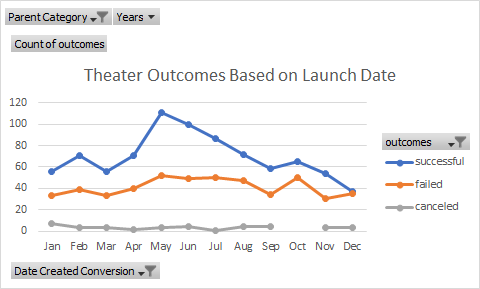

# Analysis of Kickstarter Campaigns

## Overview

### Purpose
In this Project we will be using the Kickstarter Dataset to uncover trends by cleaning up the data, creating visualizations, and analyzing them to come up with insights and reccomendations which can help aid future campaigns.
### Background
One of Louise's plays 'Fever' took only a little bit of time to come close to its campaign goal. This development made her curious about the other campaigns. Louise would like to know how both the launch dates and campaign goals affect all the campaign's outcomes.

## Analysis and Challenges
In the raw data we used conditional formatting to highlight cells in different colors based on the campaigns outcomes and used color scales on the percentage funded colomn to highlight any possible outliers in the data, making it much easier to learn about the data.

### Analysis of Outcomes Based on Launch Date
In this Chart we depict the affect that the Launch date of the theater campaigns has on its possible outcome. 

We see that there is a positive trend in success from March to May. May is the month which had the most successes. The amount of successes slowly decreases throughout the rest of the year with the exception of October. December seems to have the lowest amount of successes. When looking at the way the successful and failed outcome lines move through the months, it is clear that they tend to both have similar trends(both positive or both negative), other than June to July and November to December. The Canceled outcome does not seem to be very much affected by the Launch date.

### Analysis of Outcomes Based on Goals
In this Chart we depict how the goal amount of the theater campaigns affects the possible outcome.

There seems to be a higher rate of success at lower goals specifically with anything lower than the range of 15000 to 19999. After that point, the Outcomes seem to invert twice for a reason that we were unable to understand. For the goals at the range of 45000 to 49999, the data shows a 100% failure rate which in turn means a 0% success rate. The Cancelation rate stayed at a constant rate of 0% no matter what range the Goal was.

### Challenges and Difficulties Encountered
During the analysis, we had a few challenges. Creating the formulas to fill the PivotTable for Outcomes based on goal was quite tedious and we made many errors at first. We also thought they were extremely tedious to fix. We overcame this by realizing we could fix the formula errors using find and replace and making other minor changes. While working with the raw data we came across some other challenges. We had to change the original Unix timestamp in the deadline and launched_at columns to short dates as well as separating the subcategories and parent categories to make the data more flexible(they were originally a joint colomn.) We also had some problems calculating average contribution in the beginning since some campaigns had no backers causing the formula to divide by zero. We fixed this using the IFERROR function. 

## Results

Two conclusions can be made on the Outcomes based on Launch Date. First is that May is the best time to launch a campaign. Second is that December is the worst time to start a campaign.

A conclusion I made from the Outcomes based on Goals is that Louise should stick to lower campaign goals(lower than 15000) since those tend to have a higher success rate.

There are a few limitations that this dataset has. This dataset seems to be a legacy dataset since its data points are from 2009 to 2017. Newer data would be very useful as it would allow us to come up with recommendations more relevant to upcoming campaigns. This dataset also has a category called country, which we believe could benefit from being split into  subcategories like states, cities, etc. This would allow for better visualization and analysis that can in turn allow for the creation of more accurate reccomendations based on location. I also believe, generally, the dataset could have had a further breakdown of the categories and subcategories(ie. for plays it could be split into themes, hardware into home and office, etc.)

In this Project we saw the Outcomes by months, but if we viewed it by years it may give us a bigger picture view on how much the theater campaigns engagement has changed. We can also see how the outcomes are affected by the campaign duration (Date Ended-Date Started.)
